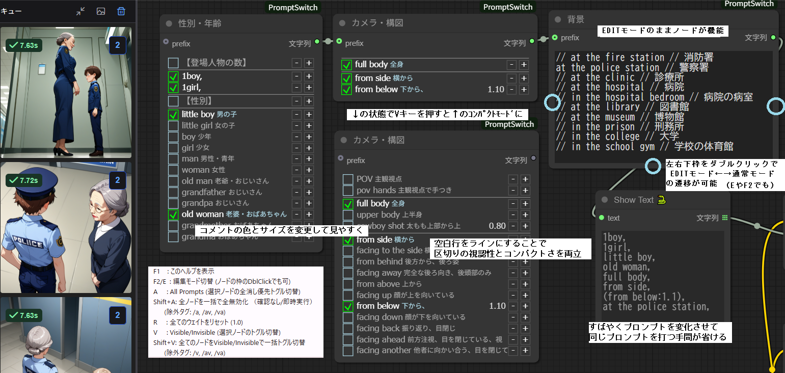
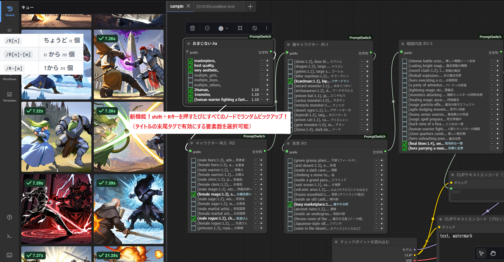

# ComfyUI-PromptSwitch Dramatically Speeds Up Prompt Work!
A custom node that allows intuitive ON/OFF switching and weight adjustment of prompts, just like a checklist.
---
Welcome to **PromptSwitch**, now available on GitHub!
This is a version that dramatically improves **prompt management and operability**, based on the idea of **Prompt Palette**.
The Japanese README is here:
https://github.com/Boba-svg/ComfyUI-PromptSwitch/blob/main/README_jp.md
To distinguish the origin of features, they are marked as follows:
* **[Original]**: Basic features inherited from Prompt Palette
* **[Switch]**: Features added or improved in PromptSwitch
---
## Main Features
※Images may be outdated. **Refer to the latest shortcuts below** (R key → Random, W key → Reset, C key → /C toggle, etc.)

Each prompt line can be operated independently, and customization is also possible.
### 1. Interactive Prompt Management
In non-edit mode, each line is displayed like a checklist.
* **[Original]** Line ON/OFF Toggle
  Click a line to enable/disable (adds `//`)
* **[Original]** Weight Adjustment
  Use `+` / `-` buttons on the right of the line to adjust in `CONFIG.WEIGHT_STEP` units (default `0.10`)
* **[Original]** Operable in Edit Mode
  Repeat execution while editing
* **[Switch]** Empty lines are displayed as separator lines
    These separator lines are also used as group dividers for random pickup
    Light blue line (`#ADD8E6`) is displayed
* **[Switch]** Separator line `//,//`
  `//,//` → Gray line (`#888`) displayed as a separator (used purely for visual organization)
  `//,// comment` → Displayed in light blue text (`#ADD8E6`) (comment line not used as a prompt element)
* **[Switch]** Display Improvements
  - Long lines are automatically truncated (max 30 characters + `...`)
  - Comments (strings after `//`) hide `//`, font size 80%, color `#ADD8E6`
### 2. Mode Switching
* **Edit Mode**
  `F2` or `E` key, or double-click the node frame
* **[Switch]** Compact Mode
  `V` key: Hide disabled lines (minimize height)
  `Shift+V`: Toggle all nodes at once (excluding `/v`)
---
## Shortcut Keys (Latest Version)
| Key | Function | Description |
|--------------|-----------------------------|------|
| `F1` | Show Help | Shortcut and tag explanations |
| `F2` / `E` | Toggle Edit Mode | Normal mode ↔ Edit mode |
| `Shift+E` | **Toggle Edit Mode for All Nodes** | Useful in edit mode as browser search highlighting works (jumping not possible) |
| `A` | Bulk ON/OFF | Toggle all lines in the selected node |
| `Shift+A` | Force Disable All Nodes | Comment out all nodes (excluding `/a`) – useful when resetting everything |
| `V` | Toggle Compact Mode | Hide disabled lines in the selected node |
| `Shift+V` | Toggle Display for All Nodes | Bulk toggle compact/normal for all nodes (excluding `/v`) |
| `W` | One-Touch Weight Reset | Reset all weights in the selected node to `1.0` |
| `R` | Random Pickup | Random selection from sections divided by empty lines (`/R` tag compatible) |
| `Shift+R` | Randomize All Nodes | Apply random pickup to all nodes (excluding `/r`) |
| `C` | **Toggle /C Tag** | Add/remove `/C` to/from the title – enables/disables random pickup trigger during image generation |
| `Shift+C` | **Remove /C from All Nodes** | Bulk remove `/C` from all nodes |
---
## Ultimate New Feature: `/C` Tag (Automatic Random Update with Each Generate Button Press)
> **"Prompts change randomly every time you press the Generate button"**
> **This is the greatest strength of PromptSwitch.**
### How to Use (Just 2 Steps)
1. **Add `/R[number] /C` to the node title**
   (`C` key toggles `/C`)
   (Example: `Facial Expression /R0-3 /C`)
2. **Press "Generate"**
   → **0 to 3 elements are randomly selected each time, and the image is generated**
**No need to press the R key at all!**
### Strengths of the `/C` Tag
| Traditional Method | With `/C` Tag |
|--------------------|-----------------------------|
| Manual update with `R` key each time | **Automatic update with one Generate** |
| Same prompt continues | **Different composition every time** |
| Trial and error is tedious | **Reach the desired image in the shortest time** |
### Full Control of Randomness with `/R` Tag
- **`/R1`** → Always **select exactly 1** randomly
- **`/R1-3`** → Randomly between **1 to 3**
- **`/R-5`** → Randomly between **0 to 5**
- **`/R-3-2`** → Randomly between **-3 to 2** (negative = 0 selection, 3 miss slots added, 0 probability ≈50%)
→ **Narrow down to the desired style while**
　　**trying variations with one Generate button press!**
---
## Tag Rules (`/C` + `/R` Required)
Add tags to the end of the node title.
**Spaces, tabs, and line breaks are ignored**. **Composite tags (e.g., `/R2a`) are invalid → warning displayed**.
| Tag | Meaning |
|--------------|------|
| `/a` | Exclude from `Shift+A` |
| `/v` | Exclude from `Shift+V` |
| `/r` | Exclude from `Shift+R` |
| `/R[n]` | Select **exactly n** from the section |
| `/R[n]-[m]` | Randomly between **n to m** |
| `/R-[m]` | Randomly between **0 to m** |
| **`/R-N-M`** | Randomly between **-N to M** (negative = 0 selection, N miss slots, total options = N+M+1) |
| **`/C`** | **Automatic random update with each Generate button press** |
> **Example: `Pose /R-8-2 /C`**
> → Randomly selects **-8 to 2** each time (0 probability ≈72.7%, max=2), reflected immediately with Generate
---
## Customization Settings (`CONFIG` in `web/index.js`)
| Variable | Default | Description |
|-----------------------------|------------|------|
| `WEIGHT_STEP` | `0.10` | Unit for weight increase/decrease |
| `minWeight` | `-1.0` | Minimum weight |
| `maxWeight` | `2.0` | Maximum weight |
| `COMMENT_FONT_SCALE` | `0.8` | Comment font size ratio |
| `PROMPT_MAX_LENGTH_DISPLAY` | `30` | Max characters displayed (truncated if exceeded) |
| `COLOR_PROMPT_ON` | `"#FFF"` | Enabled prompt color |
| `COLOR_COMMENT_ON` | `"#ADD8E6"` | Enabled comment color |
| `COLOR_PROMPT_OFF` | `"#AAAAAA"` | Disabled prompt color |
| `COLOR_COMMENT_OFF` | `"#AAAAAA"` | Disabled comment color |
| `CommentLine_LineColor` | `"#888"` | Separator line color (`//,//`) |
| `CommentLine_FontColor` | `"#ADD8E6"` | Separator comment color |
---
## Installation and Updates
### 1. Via ComfyUI Manager (Recommended)
1. Open Manager
2. Click "Install Custom Nodes"
3. Search for `PromptSwitch`
4. Install **ComfyUI-PromptSwitch**
5. Restart ComfyUI
### 2. Manual Installation
1. Navigate to the following folder
   `/path/to/ComfyUI/custom_nodes`
2. Run the command
   `git clone https://github.com/Boba-svg/ComfyUI-PromptSwitch.git`
### 3. Update
1. Navigate to the following folder
   `/path/to/ComfyUI/custom_nodes/ComfyUI-PromptSwitch`
2. Run the command
   `git pull`
---
## How to Use
1. Add **PromptSwitch** from node search (`utils` category)
2. Set **`/R[number] /C`** in the title
3. **Press "Generate" → Generate images with different prompts each time!**
---
## Update History
| Date | Content |
|------------|------|
| 25/10/16 | Initial release |
| 25/10/17 | Added exclusion tags (`/a`, `/v`) |
| 25/10/20 | Unified weight operations |
| 25/10/30 | `R` key → Random, `W` key → Reset |
| 25/10/30 | `/R[number]` expansion |
| 25/11/05 | Unified tag parsing (composite tags prohibited) |
| **25/11/07** | **Decisive Update** |
| | - **`/C` tag: Automatic random update with one Generate** |
| | - `C` key: `/C` toggle |
| | - `Shift+C`: Remove `/C` from all nodes |
| | - `Shift+E`: Toggle edit mode for all nodes (**input prevention**) |
| | - Fixed edit mode bugs |
| **25/11/08** | Fully fixed `/C` behavior (executes only once before generation) |
| **25/11/09** | Implemented comment separator `//,//` |
| **25/11/10** | **Implemented negative miss slots (`/R-N-M` format)** |
| | - `/R-3-2` → Adds 3 miss slots, increases 0 selection probability |
| | - Enhanced probability control (e.g., `/R-8-2` → 0 probability ≈72.7%) |
| | - Bug fix: Prevent exceeding max |
---
## Known Bugs
* **Starts in edit mode and cannot return to normal mode no matter what**
  (Confirmed on 2025/11/10 with large workflows)
  Close and reopen ComfyUI in the browser (Ctrl+Shift+R or other cache-clearing reload recommended)
## Planned Features
1. Implement wildcard-style random pickup to generate prompts solely on the server
2. Implement group-based random pickup using separators (e.g., RG0-2)
3. Implement non-random pickup (e.g., enable next element after 20 generations)
4. Since it only outputs text, combining with the above could allow model switching or changing output image size each time
---
## Credits
This node is a fork and extension of **kambara's ComfyUI-PromptPalette**.
---
## License
MIT License
See the [LICENSE](LICENSE) file for details
