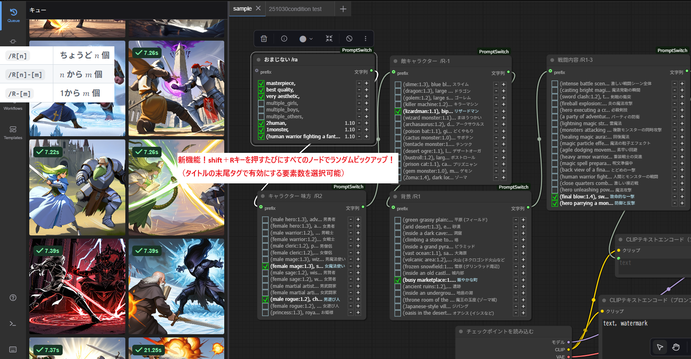

# ComfyUI-PromptSwitch プロンプト作業を劇的に高速化！

プロンプトのON/OFF切り替えやウェイト調整を、チェックリストのように直感的に行えるカスタムノードです。

---

GitHubで公開された「PromptSwitch」へようこそ！

これは、Prompt Palette のアイデアをベースに、プロンプト管理と操作性を改善したバージョンです。

日本語の README はここ：
https://github.com/Boba-svg/ComfyUI-PromptSwitch/blob/main/README_jp.md

機能の起源を区別するために、以下のように表記しています。

* [Original]：Prompt Palette から受け継いだ基本機能
* [Switch]：PromptSwitch で追加・改善された機能

---

## 主な機能

各プロンプト行を独立して操作でき、カスタマイズも可能です。

### 1. インタラクティブなプロンプト管理

非編集モードでは、各行がチェックリストのように表示されます。

* [Original] 行のON/OFF切り替え  
  行をクリックで有効/無効（// 付き）  
* [Original] ウェイト調整  
  行の右にある [+] / [-] ボタンで、CONFIG.WEIGHT_STEP（デフォルト 0.10）単位で調整  
* [Original] 編集モードでも操作可能  
  編集しながら実行を繰り返せます  
* [Switch] 空行に区切り線  
  空行に細い線を表示  
* [Switch] 表示の改善  
  - 長い行は自動省略  
  - コメント行（// で始まる）は // を非表示、フォントサイズ・色を調整

### 2. モード切り替え

* 編集モード  
  F2 または E キー、またはノードの枠をダブルクリック  
* [Switch] ミニマムモード  
  V キー：無効行を非表示（コンパクト表示）

---

## ショートカットキー

| キー | 機能 | 説明 |
|------|------|------|
| A | まとめてON/OFF | 選択ノードの全行をトグル |
| Shift + A | 全ノード強制無効化 | 全ノードをコメントアウト（/a 除外） |
| V | コンパクトモード切替 | 選択ノードの無効行を非表示 |
| Shift + V | 全ノード表示切替 | 全ノードをコンパクト/通常に一括切替（/v 除外） |
| W | ウェイト一発リセット | 選択ノードの全ウェイトを 1.0 にリセット |
| R | ランダムピックアップ | 空行区切りのセクションからランダム選択（/R[数] 対応） |
| Shift + R | 全ノードランダム | 全ノードにランダムピックアップ（/r 除外） |
| **C** | **/C タグのトグル** | **タイトルに /C を追加/削除** |
| **Shift + C** | **全ノードから /C 削除** | **全ノードの /C を一括削除** |
| Shift + E | 全ノード編集モード切替 | 全ノードを一括で編集モードON/OFF（入力防止） |
| F1 | ヘルプ表示 | ショートカットとタグの説明 |
| F2 / E | 編集モード切替 | 通常モード ↔ 編集モード |

---

## 最強の新機能：/C タグ（生成ボタン1回ごとに自動ランダム更新）

> **「Generate ボタンを押すたびに、プロンプトが自動でランダムに変わる」**

**これが PromptSwitch の最大の強みです。**

### 使い方（たった2ステップ）

1. ノードタイトルに **`/R[数] /C`** を追加  
   （例：`顔の表情 /R0-3 /C`）  
2. **「Generate」ボタンを押す**

→ **押すたびに、0〜3個の要素が自動でランダム選択され、画像が生成されます。**
（ランダムピックアップの内容は/Rタグの制御下にあるので混沌具合を自分でコントロールできる）  
**R キーなんて押す必要はありません。**

### /C タグの強み

| 従来の方法 | /C タグあり |
|------------|-------------|
| 毎回 R キーを押して手動更新 | **Generate 1回で自動更新** |
| 同じプロンプトが続く | **1回1回違う構成** |
| 試行錯誤が面倒 | **目的の絵に最短で到達** |

### ランダム具合は /R タグで完全制御

- **`/R1`** → 毎回 **1個だけ** ランダム選択  
- **`/R1-3`** → 毎回 **1〜3個** の間でランダム  
- **`/R-5`** → 毎回 **最大5個** までランダム  

→ **「狙ったテイスト」に絞りながら、**  
　　**Generate ボタン1回でバリエーションを試せる！**

---

## タグのルール（/C + /R 必須）

ノードタイトルの末尾にタグを追加。  
スペース・タブ・改行は無視。複合タグ（例: /R2a）は無効（警告表示）。

| タグ | 意味 |
|------|------|
| /a | Shift+A から除外 |
| /v | Shift+V から除外 |
| /r | Shift+R から除外 |
| /R[n] | セクションからちょうど n 個選択 |
| /R[n]-[m] | n 〜 m 個の間でランダム |
| /R-[m] | 1 〜 m 個 |
| /R[m]-[n] | n 〜 m 個（順不同） |
| **/C** | **Generate ボタン1回ごとに自動ランダム更新** |

> **例：`ポーズ /R2 /C`**  
> → 毎回 **2つのポーズ** を自動選択し、Generate で即反映

---

## カスタマイズ設定（web/index.js 内 CONFIG）

| 変数 | デフォルト | 説明 |
|------|------------|------|
| WEIGHT_STEP | 0.10 | ウェイト増減の単位 |
| minWeight | -1.0 | 最小ウェイト |
| maxWeight | 2.0 | 最大ウェイト |
| COMMENT_FONT_SCALE | 0.8 | コメントのフォントサイズ比率 |
| PROMPT_MAX_LENGTH_DISPLAY | 30 | 表示時の最大文字数（超えると省略） |
| COLOR_PROMPT_ON | "#FFF" | 有効プロンプトの色 |
| COLOR_COMMENT_ON | "#ADD8E6" | 有効コメントの色 |
| COLOR_PROMPT_OFF | "#AAAAAA" | 無効プロンプトの色 |
| COLOR_COMMENT_OFF | "#AAAAAA" | 無効コメントの色 |

---

## インストールとアップデート

### 1. ComfyUI Manager から（推奨）

1. Manager を開く  
2. "Install Custom Nodes" をクリック  
3. PromptSwitch で検索  
4. ComfyUI-PromptSwitch をインストール  
5. ComfyUI を再起動

### 2. 手動インストール

1. 以下のフォルダに移動  
   /path/to/ComfyUI/custom_nodes  
2. 以下のコマンドを実行  
   git clone https://github.com/Boba-svg/ComfyUI-PromptSwitch.git

### 3. アップデート

1. 以下のフォルダに移動  
   /path/to/ComfyUI/custom_nodes/ComfyUI-PromptSwitch  
2. 以下のコマンドを実行  
   git pull

---

## 使い方

1. ノード検索から PromptSwitch を追加（utils カテゴリ）  
2. タイトルに **`/R[数] /C`** を設定  
3. **「Generate」を押す → 毎回違うプロンプトで画像生成！**

---

## アップデート履歴

1. 25/10/16 公開  
2. 25/10/17 除外タグ追加（/a, /v）  
3. 25/10/20 ウェイト操作の統一  
4. 25/10/30 Rキー → ランダム、Wキー → リセット  
5. 25/10/30 /R[数] 拡張  
6. 25/11/05 タグパース統一（複合禁止）  
7. **25/11/07 決定版アップデート**  
   - **/C タグ：Generate ボタン1回ごとに自動ランダム更新**  
   - **C キー：/C トグル**  
   - **Shift+C：全ノードから /C 削除**  
   - **Shift+E：全編集モード切替（入力防止）**  
   - 編集モードのバグ修正

---

## 次に予定

1. 空白行の改行を除去  
2. 最後に改行を入れないモード  
3. 複数タグ時のランダムバグ修正

---

## クレジット

このノードは、kambara 氏の ComfyUI-PromptPalette をフォークし、拡張したものです。

---

## ライセンス

MITライセンス  
詳細は LICENSE ファイル参照
